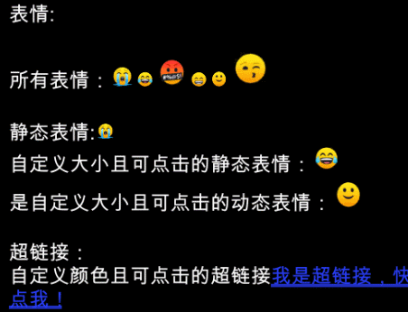

# EmojiText

## 表情效果

## 组件功能
1. 支持动态表情，表情大小可以自定义，而且表情支持点击
2. 支持超链接，而且超链接颜色可以自定义
3. 表情的帧数无限制，只有一帧时，渲染成静态表情
4. 支持将零散的单个表情合并成一张图集，并生成配置文件
5. 支持表情速度调整

## 使用说明
1. 将单个表情按规则 `name_xx` （其中 `name` 表示表情名字，`xx` 表示表情帧数，如果只有一帧，则直接命名即可） 命名。
2. 选中所有的表情图片，然后选择菜单栏 Tools -> Emoji Build 可以生成表情图集和配置。
3. 新建 Canvas，然后选中 Canvas 右键选择 UI -> EmojiText 创建动态表情组件
4. 选中 EmojiText，将创建的 Emoji.asset 赋值到 Emoji Asset 属性。
5. 具体使用见 Example